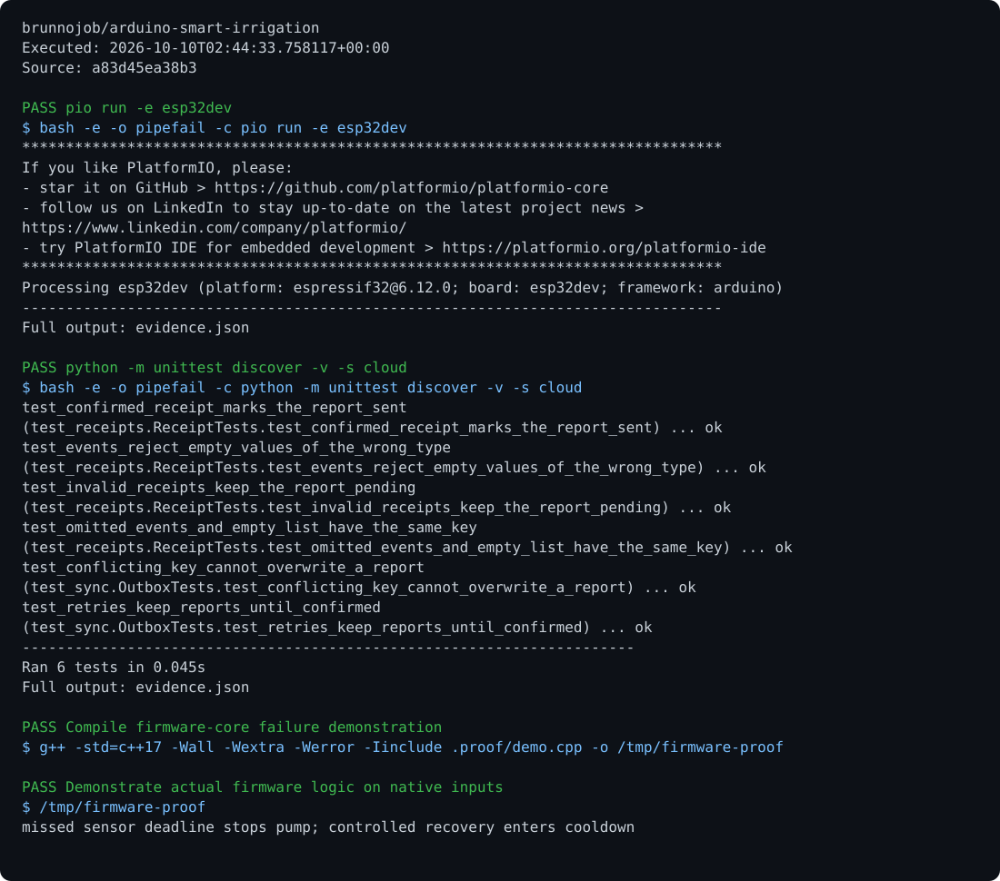

# Smart Irrigation

Irrigation control with filtering, hysteresis, a minimum interval, a maximum pump runtime, a reservoir sensor, and fault lockout.

## Run

Requirements: ESP32, C++17, and PlatformIO.

```sh
pio run -e esp32dev
pio run -e esp32dev -t upload
python -m pip install -r cloud/requirements.txt
python cloud/serial_bridge.py /dev/ttyUSB0
```

## Behavior

ADC: GPIO 34. Pump: GPIO 26. Button: GPIO 27. Reservoir: GPIO 25. The pump starts off; manual starts respect lockouts. Pure logic is in `include/irrigation.hpp` and is tested without hardware. Calibrate the sensor and validate the relay and active signal level before wiring.

## Optional report archive

Export a JSON report from the command above, then run `python cloud/sync.py enqueue result.json --project arduino-smart-irrigation` and `python cloud/sync.py sync`. Synchronization requires `BRUNNODEV_ACCESS_TOKEN` and the external operations API; the local outbox retains unacknowledged reports.

## License

Original source and documentation are MIT licensed; see [LICENSE](LICENSE). Third-party dependencies and media retain their respective terms. Maintained by [Brunno Dev](https://brunnodev.store).

## Implementation update

A loop-level watchdog deenergizes the pump when samples stop arriving. Fault recovery requires an explicit valid manual reset and returns through cooldown. The maximum run limit also applies between ADC samples. Native regression checks are in `tests/runtime_regressions.cpp`.

Contribution trailer: `Co-authored-by: nyctophile <33561761+ineedfoundmyway@users.noreply.github.com>`.

## Execution proof

[](https://github.com/brunnojob/arduino-smart-irrigation/actions/workflows/proof.yml)



[Verified run](https://github.com/brunnojob/arduino-smart-irrigation/actions/runs/38018062355) · [Execution report](docs/proof/evidence.json)

Run `python .proof/record.py` after installing the prerequisites above. The scenarios execute repository code and verify exit codes and expected output. CI publishes `execution-proof` with the transcript, input fingerprints and source commit. The downloadable report identifies the exact tested version; the workflow badge tracks the latest run.
